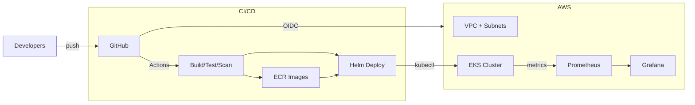

# Architecture

```mermaid
flowchart LR
  Dev[Developers] -->|push| GH[GitHub]
  GH -->|OIDC| AWS[(AWS IAM)]
  subgraph CI/CD
    GH -->|Actions| CI[Build/Test/Scan]
    CI --> ECR[ECR Images]
    CI --> Helm[Helm Deploy]
  end

  subgraph AWS
    VPC[VPC + Subnets]
    EKS[EKS Cluster]
    ECR --> Helm
    Helm -->|kubectl| EKS
    EKS -->|metrics| Mon[Prometheus]
    Mon --> Grafana[Grafana]
  end
```
